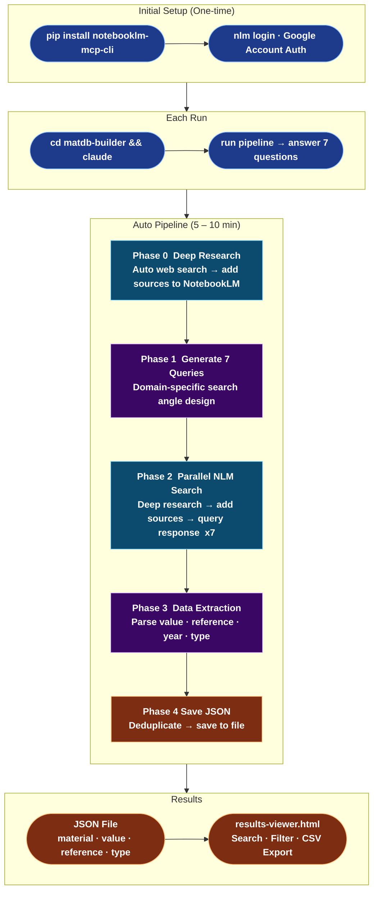
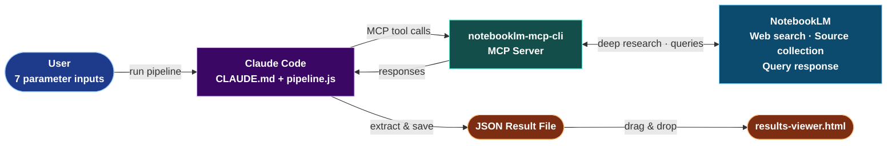

# Pipeline Detailed Guide / 파이프라인 상세 가이드

NotebookLM automatically searches the web for papers, datasheets, and reports.  
Claude extracts numerical data and organizes it into a searchable material database.

---

## Table of Contents

1. [System Architecture](#1-system-architecture)
2. [Prerequisites](#2-prerequisites)
3. [Pre-run Checklist](#3-pre-run-checklist)
4. [Running the Pipeline — 7 Questions](#4-running-the-pipeline--7-questions)
5. [Auto-execution Details (Phase 0–4)](#5-auto-execution-details-phase-04)
6. [Result File Structure](#6-result-file-structure)
7. [results-viewer.html Usage](#7-results-viewerhtml-usage)
8. [Running Multiple Times / File Management](#8-running-multiple-times--file-management)
9. [CSV Export](#9-csv-export)
10. [Troubleshooting](#10-troubleshooting)

---

## 1. System Architecture

### Full Data Flow



### Component Relationships



### Component Roles

| Component | Role |
|-----------|------|
| **Claude Code** | AI pipeline execution engine. Uses Claude Pro subscription — no separate API key needed |
| **notebooklm-mcp-cli** | NotebookLM automation MCP server (`pip` package, provides `nlm` command) |
| **`.claude/settings.json`** | Auto-loads MCP server when Claude Code starts from this folder (included in repo) |
| **`CLAUDE.md`** | Claude Code AI behavior instructions — 7 questions → save config → run Workflow |
| **`pipeline-config.json`** | Stores run parameters (auto-generated, in `.gitignore`) |
| **`pipeline.js`** | Workflow script — runs Phase 0–4 automatically |
| **`results-viewer.html`** | Browser-based result viewer. No server needed, load JSON via drag & drop |

---

## 2. Prerequisites

### 2-1. Install Claude Code

1. Go to [https://claude.ai/code](https://claude.ai/code)
2. Download and install for Windows or Mac
3. **Claude Pro subscription required** ($20/mo)

> Claude Code uses your Claude Pro subscription directly — **no additional API cost**.

### 2-2. Verify Python

```powershell
python --version
```

Python 3.8+ required. Install from [https://python.org](https://python.org) if missing.

### 2-3. Install NotebookLM MCP CLI

```powershell
pip install notebooklm-mcp-cli
```

Verify installation:

```powershell
nlm --version
```

> Reference: [https://github.com/jacob-bd/notebooklm-mcp-cli](https://github.com/jacob-bd/notebooklm-mcp-cli)

### 2-4. Log in to NotebookLM

```powershell
nlm login
```

A browser window opens automatically. Sign in with the **Google account you use for NotebookLM**.  
You'll see "Login successful" in the terminal when done.

> Sessions expire after some time. Re-run `nlm login` if you get an authentication error.

### 2-5. Clone this repo

```powershell
git clone https://github.com/dudtjq414/matdb-builder.git
cd matdb-builder
```

### 2-6. MCP configuration

`.claude/settings.json` is already included in the repo — **no manual configuration needed**:

```json
{
  "mcpServers": {
    "notebooklm-mcp": {
      "command": "notebooklm-mcp"
    }
  }
}
```

### 2-7. Prepare a NotebookLM notebook

1. Go to [https://notebooklm.google.com](https://notebooklm.google.com)
2. **Create a new notebook** (title it with your research topic)
3. Copy the full URL from the browser address bar:
   ```
   https://notebooklm.google.com/notebook/abc123-def456-7890-...
   ```

> **You do not need to upload papers manually.**  
> Phase 0 deep research automatically finds and adds relevant papers and datasheets from the web.

---

## 3. Pre-run Checklist

Before each run:

```
□ Claude Pro subscription is active
□ pip install notebooklm-mcp-cli completed
□ nlm login completed (re-run if session expired)
□ NotebookLM notebook URL ready
□ In PowerShell: cd matdb-builder, then claude (most important!)
```

> **⚠️ Do NOT type `! cd matdb-builder` inside the Claude Code chat.**  
> Claude Code reads `.claude/settings.json` based on the folder it was launched from.  
> Always move to the folder first in your terminal, then run `claude`.

Check MCP connection status with:

```
/doctor
```

---

## 4. Running the Pipeline — 7 Questions

### Start Claude Code

```powershell
cd matdb-builder
claude
```

### Trigger the pipeline

Type in chat:

```
run pipeline
```

Keywords like `pipeline`, `extract data`, `파이프라인` also work.

---

### Question 1 — NotebookLM Notebook URL

```
https://notebooklm.google.com/notebook/abc123-def456-7890abcd...
```

Paste the full URL from the browser address bar. The notebook ID is extracted automatically.

---

### Question 2 — Material / System

Be specific — the more specific, the better the search results.

| Good example | Bad example | Reason |
|-------------|-------------|--------|
| `amine-cured epoxy resin` | `epoxy` | Too broad |
| `carbon fiber reinforced epoxy composite` | `composite` | Material not specified |
| `lithium-ion battery NMC cathode` | `battery material` | Part not specified |
| `polyimide film` | `polymer` | Too general |

---

### Question 3 — Property to Measure

**Use English** — improves paper search accuracy.

| Good example | Bad example | Reason |
|-------------|-------------|--------|
| `Young's Modulus` | `elastic modulus` | Standard name preferred |
| `tensile strength` | `strength` | Type of strength unclear |
| `thermal conductivity` | `thermal property` | Too broad |
| `ionic conductivity` | `conductivity` | Type unclear |

---

### Question 4 — Unit

Only values matching this unit will be collected.

| Property | Common units |
|----------|-------------|
| Young's Modulus | `GPa`, `MPa` |
| Tensile strength | `MPa` |
| Thermal conductivity | `W/mK` |
| Ionic conductivity | `mS/cm` |
| Glass transition temperature | `°C`, `K` |
| Fracture toughness | `MPa·m^0.5` |

---

### Question 5 — Data Classification Criterion

This becomes the primary grouping column in the CSV and viewer.

| Good example | Bad example | Reason |
|-------------|-------------|--------|
| `epoxy type` | `type` | Type of what? |
| `curing agent` | `condition` | Condition of what? |
| `fiber orientation angle` | `angle` | Angle of what? |
| `manufacturer and product grade` | `brand` | Too vague |

---

### Question 6 — Measurement Methods to Exclude *(optional)*

Reduces noise by excluding specific test methods.

| Exclude example | Reason |
|----------------|--------|
| `DMA storage modulus (E')` | Dynamic measurement, differs from tensile Young's Modulus |
| `nanoindentation` | Surface local measurement, not comparable to bulk |
| `compression test` | Not directly comparable to tensile properties |
| `theoretical calculation` | Separate from experimental data |

**Type `none` if no exclusions.** Pressing Enter alone does not advance to the next question.

---

### Question 7 — Output Filename

Use different filenames per topic to keep results separate.

| Input | Saved file |
|-------|-----------|
| `epoxy-youngs-modulus.json` | `./epoxy-youngs-modulus.json` |
| `cf-tensile-strength.json` | `./cf-tensile-strength.json` |
| `none` | `./pipeline-result.json` (default) |

> Re-running with the same filename overwrites the file.

---

### Pipeline Starts Automatically

Once all 7 answers are provided, Claude:

1. Saves `pipeline-config.json` automatically
2. Starts the `pipeline.js` Workflow

**~5–10 minutes of automated execution follows.** Progress is shown step by step.

---

## 5. Auto-execution Details (Phase 0–4)

### Phase 0 — Deep Research

```
Research topic keywords (in English)
    → NotebookLM research_start
    → Poll until status = complete
    → research_import: add found sources to notebook
```

NotebookLM automatically searches the web for relevant papers, technical datasheets, and reports, and adds them as notebook sources.  
**You do not need to upload any papers manually.**

> Requires NotebookLM deep research feature (Google One AI Premium or Google Workspace).

---

### Phase 1 — Generate 7 Queries

Claude designs 7 search angles tailored to your research domain:

| # | Search angle | Goal |
|---|-------------|------|
| 1 | Comprehensive data sweep across all categories | Maximize data coverage |
| 2 | Quantitative comparison by classification criterion | Confirm differences between groups |
| 3 | Eco-friendly / bio-based / novel material variants | Capture non-traditional material data |
| 4 | MD/ML predictions vs experimental values | Collect simulation and experimental data together |
| 5 | High-performance cases from last 5 years (2020–2025) | Reflect latest research trends |
| 6 | Measurement method differentiation & exclusion validation | Improve exclusion criterion accuracy |
| 7 | Data-sparse category deep dive | Surface rare data |

---

### Phase 2 — Parallel NotebookLM Search ×7

All 7 queries run **simultaneously**. Each query independently:

```
Query keywords → start deep research → wait for completion
               → add sources         → send query → save response
```

Parallel execution is much faster than sequential.

---

### Phase 3 — Data Extraction

Parses numerical data from each NotebookLM response.

**Inclusion criteria**:
- Tensile test or flexural/bending test measurements
- MD/ML simulation values (dataType: "MD" or "ML")
- Values matching the specified unit only

**Extracted fields**:

| Field | Format | Example |
|-------|--------|---------|
| `materialName` | English | `DGEBA/DETA 20phr` |
| `category` | English | `Aliphatic amine` |
| `value` | Number | `3.8` |
| `dataType` | `Exptl` / `MD` / `ML` | `Exptl` |
| `reference` | Source-type-specific format (see below) | `Kim et al. (2023), Polymer` |
| `year` | 4-digit year | `2023` |
| `notes` | DOI, URL, full title | `DOI: 10.1016/j.polymer.2023.01.001` |

**Reference format by source type**:

| Source type | Format | Example |
|-------------|--------|---------|
| Journal paper | `1st author et al. (year), Journal` | `Kim et al. (2023), Polymer` |
| Single-author paper | `Author (year), Journal` | `Zhang (2021), J. Mater. Sci.` |
| Technical datasheet | `Manufacturer, Product Datasheet (year)` | `Huntsman, Araldite LY1564 Datasheet (2020)` |
| Standard / specification | `Organization, Standard No.:year` | `ASTM D638-22` / `ISO 527-1:2019` |
| Report / white paper | `Organization (year), First 5 words of title` | `Toray Industries (2022), Carbon Fiber T700S Properties` |

---

### Phase 4 — Save

Removes duplicates (same material name + same value + same data type) and saves to the specified JSON file.  
A summary of collected and excluded entries is displayed on completion.

---

## 6. Result File Structure

```json
{
  "material": "amine-cured epoxy resin",
  "propertyName": "Young's Modulus",
  "unit": "GPa",
  "notebookId": "abc123-def456",
  "totalEntries": 95,
  "totalExcluded": 12,
  "byCategory": {
    "Aliphatic amine": 23,
    "Aromatic amine": 31,
    "Anhydride": 18,
    "Bio-based": 14,
    "Other": 9
  },
  "queries": [
    { "badge": "Q1", "title": "Comprehensive data sweep", "prompt": "..." }
  ],
  "entries": [
    {
      "materialName": "DGEBA/DETA 20phr",
      "category": "Aliphatic amine",
      "value": 3.8,
      "dataType": "Exptl",
      "reference": "Kim et al. (2023), Polymer",
      "year": 2023,
      "notes": "DOI: 10.1016/j.polymer.2023.01.001"
    }
  ],
  "excluded": [
    { "materialName": "DGEBA/DDM", "reason": "DMA E' measurement — excluded per criterion" }
  ]
}
```

---

## 7. results-viewer.html Usage

### Open

1. Double-click `results-viewer.html` to open in browser (no server needed)
2. **Drag and drop** the JSON file onto the center of the page, or click to select

### Screen Layout

```
┌────────────────────────────────────────────────────────────────┐
│  matdb-builder  Results Viewer                                 │
│  ─────────────────────────────────────────────────────────    │
│  [ Search: material name, category, reference (live)   ]      │
│                                                                │
│  [ All ]  [ Exptl ]  [ MD ]  [ ML ]   ← data type filter      │
│                                                                │
│  [Aliphatic amine] [Aromatic amine] [Bio-based] [Anhydride]   │
│                               ↑ category chip filter           │
│  ──────────────────────────────────────────────────────────   │
│  Material Name      Category       Value  Type  Reference Year │
│  DGEBA/DETA 20phr   Aliphatic am   3.8    Exptl  Kim 2023      │
│  DGEBA/DDM          Aromatic am    4.1    Exptl  Zhang 2021    │
│  Bio-epoxy/DETA     Bio-based      2.9    MD     Lee 2022      │
│  ──────────────────────────────────────────────────────────   │
│            [ Sort: Value High → Low ▼ ]  [ Export CSV ]        │
└────────────────────────────────────────────────────────────────┘
```

### Features

| Feature | How to use | Description |
|---------|-----------|-------------|
| **Live search** | Type in search box | Searches material name, category, and reference simultaneously |
| **Data type filter** | Click All / Exptl / MD / ML | Filter experimental vs simulation data |
| **Category chip filter** | Click a category button | Show only that category |
| **Sort** | Dropdown selection | Value high→low / low→high / newest |
| **CSV export** | Click Export CSV button | Exports current filtered/searched view to CSV |
| **Row click** | Click any data row | Shows full details including notes (DOI etc.) |

---

## 8. Running Multiple Times / File Management

Use **different filenames** per topic to keep results separate.

**Example: collecting multiple properties for the same material**

| Run | Material | Property | Output filename |
|-----|----------|----------|----------------|
| 1st | Amine-cured epoxy | Young's Modulus | `epoxy-youngs-modulus.json` |
| 2nd | Amine-cured epoxy | Tensile strength | `epoxy-tensile-strength.json` |
| 3rd | Carbon fiber composite | Flexural modulus | `cf-flexural-modulus.json` |

Open each JSON file separately in `results-viewer.html`.

### Update to latest version

```powershell
cd matdb-builder
git pull
```

---

## 9. CSV Export

Clicking **Export CSV** in `results-viewer.html` saves the currently visible data (reflecting all active filters and search) to a CSV file.

### CSV column layout

| Column header | Content |
|---------------|---------|
| `Material Name` | Material name (English) |
| `Category` | Classification category (English) |
| `Value` | Numerical value |
| `Unit` | Unit |
| `Data Type` | `Exptl` / `MD` / `ML` |
| `Reference` | Source (author·year·journal or manufacturer·product etc.) |
| `Year` | Publication year |
| `Notes` | DOI, URL, full title, or other identifier |

> **Korean characters display correctly in Excel.**  
> The CSV includes a UTF-8 BOM so Excel automatically recognizes it as UTF-8.

---

## 10. Troubleshooting

| Symptom | Cause | Fix |
|---------|-------|-----|
| `notebooklm-mcp` MCP not found | Claude Code started outside matdb-builder folder | In PowerShell: `cd matdb-builder` then `claude` |
| `nlm` command not found | notebooklm-mcp-cli not installed | Run `pip install notebooklm-mcp-cli` |
| `nlm login` browser doesn't open | WSL or virtual environment issue | Run in plain PowerShell (not as Administrator) |
| NotebookLM MCP auth error | Login session expired | Run `nlm login` again, then restart pipeline |
| Phase 0 deep research fails | Deep research not available for this account | Check if NotebookLM shows a Deep Research tab directly |
| 0 entries extracted | NotebookLM returned empty response | Verify notebook URL / re-run `nlm login` |
| Too few entries | Search scope too narrow | Broaden classification criterion or reduce exclusions |
| References are vague | Source citation info incomplete in original | Check `notes` field for DOI or title — original source may lack full citation |
| CSV garbled in Excel | Using old version | Run `git pull` then re-export (latest version includes UTF-8 BOM) |
| Claude session limit reached | Claude Pro usage limit hit | Wait for reset (~5 hours), then type `run pipeline` again |
| `pipeline-config.json` parse error | File format corrupted | Delete the file and restart the pipeline from scratch |

---

## Real-world Results

| Material | Property | Sources collected | Entries | Time |
|----------|----------|------------------|---------|------|
| Amine-cured epoxy resin | Young's Modulus (GPa) | 31 papers | 95 entries | ~8 min |

---

<details>
<summary>한국어 가이드 펼치기 (Korean Guide)</summary>

## 목차

1. [시스템 구조](#시스템-구조)
2. [사전 준비](#사전-준비)
3. [실행 전 체크리스트](#실행-전-체크리스트)
4. [파이프라인 실행 — 7가지 질문](#파이프라인-실행--7가지-질문)
5. [자동 실행 과정 (Phase 0~4)](#자동-실행-과정-phase-04)
6. [결과 파일 구조](#결과-파일-구조)
7. [results-viewer.html 사용법](#results-viewerhtml-사용법)
8. [여러 번 실행하기](#여러-번-실행하기)
9. [CSV 내보내기](#csv-내보내기)
10. [문제 해결](#문제-해결)

> 다이어그램은 위 영어 섹션을 참고하세요.

---

## 시스템 구조

| 컴포넌트 | 역할 |
|----------|------|
| **Claude Code** | AI 파이프라인 실행 엔진. Claude Pro 구독 사용 — 별도 API 키 불필요 |
| **notebooklm-mcp-cli** | NotebookLM 자동화 MCP 서버 (`pip` 패키지, `nlm` 명령어 제공) |
| **`.claude/settings.json`** | Claude Code가 시작 시 MCP 서버를 자동 로드하는 설정 파일 (repo에 포함) |
| **`CLAUDE.md`** | Claude Code AI의 행동 지침 — 7가지 질문 → config 저장 → Workflow 실행 |
| **`pipeline-config.json`** | 실행 파라미터 저장 파일 (자동 생성, `.gitignore`에 포함) |
| **`pipeline.js`** | Workflow 스크립트 — Phase 0~4 자동 실행 |
| **`results-viewer.html`** | 결과 브라우저 뷰어. 서버 불필요, 드래그앤드롭으로 JSON 로드 |

---

## 사전 준비

### Claude Code 설치
1. [https://claude.ai/code](https://claude.ai/code) 접속 → 설치
2. **Claude Pro 구독** 필요 (월 $20) — 별도 API 비용 없음

### Python 확인
```powershell
python --version
```
Python 3.8 이상 필요.

### NotebookLM MCP CLI 설치
```powershell
pip install notebooklm-mcp-cli
nlm login
```
브라우저에서 NotebookLM Google 계정으로 로그인.

### repo 클론
```powershell
git clone https://github.com/dudtjq414/matdb-builder.git
cd matdb-builder
claude
```
> **반드시 `cd matdb-builder` 후 `claude`를 실행**해야 합니다. Claude Code 채팅창에서 `! cd matdb-builder`는 동작하지 않습니다.

---

## 실행 전 체크리스트

```
□ Claude Pro 구독 활성화 상태
□ pip install notebooklm-mcp-cli 완료
□ nlm login 완료 (세션 만료 시 재로그인 필요)
□ NotebookLM 노트북 URL 준비
□ PowerShell에서 cd matdb-builder 후 claude 실행
```

---

## 파이프라인 실행 — 7가지 질문

채팅창에 입력:
```
파이프라인 실행해줘
```

| # | 질문 항목 | 입력 예시 |
|---|-----------|----------|
| 1 | NotebookLM 노트북 URL | `https://notebooklm.google.com/notebook/abc123-...` |
| 2 | 연구 재료/시스템 | `아민계 경화 에폭시 수지` |
| 3 | 측정 물성 | `Young's Modulus` |
| 4 | 물성 단위 | `GPa` |
| 5 | 데이터 분류 기준 | `에폭시 계열` |
| 6 | 제외할 측정 방법 | `DMA E', 나노인덴테이션` (없으면 `없음`) |
| 7 | 결과 파일명 | `epoxy-youngs-modulus.json` (없으면 `없음`) |

---

## 자동 실행 과정 (Phase 0~4)

| Phase | 내용 |
|-------|------|
| **Phase 0** 딥리서치 | NotebookLM이 웹에서 논문·데이터시트 자동 검색 → 노트북 소스 추가 |
| **Phase 1** 쿼리 생성 | 연구 도메인 특화 탐색 방향 7가지 설계 |
| **Phase 2** 병렬 탐색 | 7개 쿼리 동시 실행: 딥리서치 → 소스 추가 → 쿼리 응답 |
| **Phase 3** 데이터 추출 | 수치·출처·연도·유형 파싱 (재료명·계열 영어 표기) |
| **Phase 4** 저장 | 중복 제거 → 지정 파일 저장 |

**reference 형식**:

| 출처 종류 | 예시 |
|-----------|------|
| 학술논문 | `Kim et al. (2023), Polymer` |
| 기술 데이터시트 | `Huntsman, Araldite LY1564 Datasheet (2020)` |
| 규격/표준 | `ASTM D638-22` |
| 보고서 | `Toray Industries (2022), Carbon Fiber T700S Properties` |

---

## 결과 파일 구조

```json
{
  "material": "아민계 경화 에폭시 수지",
  "propertyName": "Young's Modulus",
  "unit": "GPa",
  "totalEntries": 95,
  "entries": [
    {
      "materialName": "DGEBA/DETA 20phr",
      "category": "Aliphatic amine",
      "value": 3.8,
      "dataType": "Exptl",
      "reference": "Kim et al. (2023), Polymer",
      "year": 2023,
      "notes": "DOI: 10.1016/j.polymer.2023.01.001"
    }
  ]
}
```

---

## results-viewer.html 사용법

1. `results-viewer.html`을 브라우저에서 더블클릭
2. JSON 파일을 드래그앤드롭 또는 클릭하여 선택

**주요 기능**: 실시간 검색 · Exptl/MD/ML 필터 · 계열 칩 필터 · 정렬 · CSV 내보내기 · 행 클릭 시 DOI 표시

---

## 여러 번 실행하기

파일명을 다르게 지정하여 결과를 분리합니다:

| 실행 | 물성 | 파일명 |
|------|------|--------|
| 1차 | Young's Modulus | `epoxy-youngs-modulus.json` |
| 2차 | 인장강도 | `epoxy-tensile-strength.json` |

최신 버전 업데이트: `git pull`

---

## CSV 내보내기

현재 필터·검색 결과 그대로 CSV 저장. UTF-8 BOM 포함으로 Excel에서 한글 깨짐 없음.

| 컬럼 | 내용 |
|------|------|
| Material Name | 재료명 (영어) |
| Category | 분류 계열 (영어) |
| Value / Unit | 수치 / 단위 |
| Data Type | Exptl / MD / ML |
| Reference | 출처 |
| Year | 연도 |
| Notes | DOI, URL, 전체 제목 |

---

## 문제 해결

| 증상 | 해결 방법 |
|------|----------|
| MCP를 찾을 수 없음 | `cd matdb-builder` 후 `claude` 재실행 |
| `nlm` 명령 없음 | `pip install notebooklm-mcp-cli` |
| 인증 오류 | `nlm login` 재실행 |
| 추출 건수 0건 | 노트북 URL 확인 / `nlm login` 재실행 |
| 추출 건수 적음 | 분류 기준 넓히기 / 제외 기준 줄이기 |
| CSV 한글 깨짐 | `git pull` 후 재내보내기 |
| Claude 세션 한도 초과 | 5시간 후 "파이프라인 실행해줘" 재입력 |

</details>
