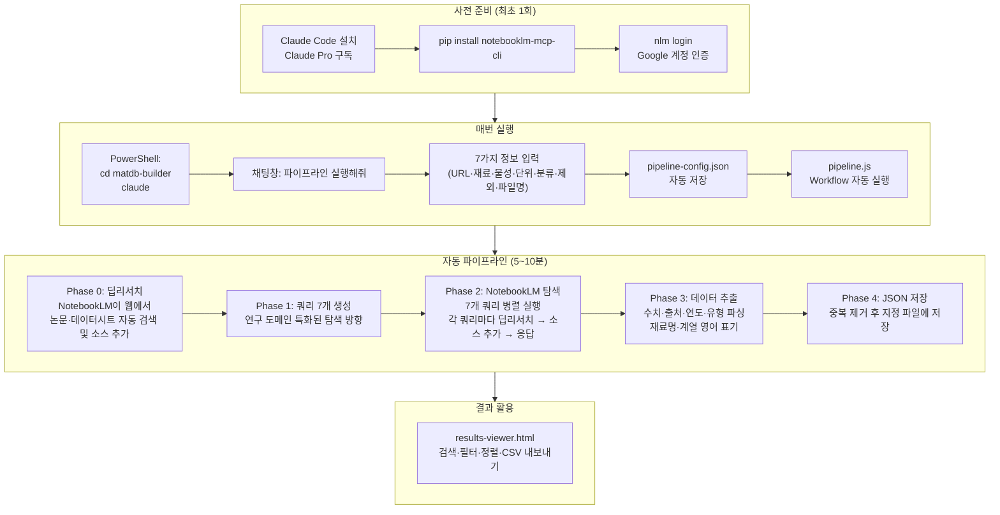

# 파이프라인 상세 가이드

NotebookLM이 웹에서 논문·기술 데이터시트·보고서를 자동으로 검색·수집하고,  
Claude가 수치 데이터를 추출하여 검색 가능한 재료 데이터베이스로 정리합니다.

---

## 목차

1. [시스템 구조](#1-시스템-구조)
2. [사전 준비](#2-사전-준비)
3. [실행 전 체크리스트](#3-실행-전-체크리스트)
4. [파이프라인 실행 — 7가지 질문 안내](#4-파이프라인-실행--7가지-질문-안내)
5. [자동 실행 과정 상세 (Phase 0~4)](#5-자동-실행-과정-상세-phase-04)
6. [결과 파일 구조](#6-결과-파일-구조)
7. [results-viewer.html 사용법](#7-results-viewerhtml-사용법)
8. [여러 번 실행하기 / 파일 관리](#8-여러-번-실행하기--파일-관리)
9. [CSV 내보내기](#9-csv-내보내기)
10. [문제 해결](#10-문제-해결)

---

## 1. 시스템 구조

### 전체 데이터 흐름



### 컴포넌트 역할 요약

| 컴포넌트 | 역할 |
|----------|------|
| **Claude Code** | AI 파이프라인 실행 엔진. Claude Pro 구독 사용 — 별도 API 키 불필요 |
| **notebooklm-mcp-cli** | NotebookLM 자동화 MCP 서버 (`pip` 패키지, `nlm` 명령어 제공) |
| **`.claude/settings.json`** | Claude Code가 시작 시 MCP 서버를 자동 로드하는 설정 파일 (repo에 포함) |
| **`CLAUDE.md`** | Claude Code AI의 행동 지침 — 7가지 질문 → config 저장 → Workflow 실행 |
| **`pipeline-config.json`** | 실행 파라미터 저장 파일 (자동 생성, `.gitignore`에 포함되어 git에 올라가지 않음) |
| **`pipeline.js`** | Workflow 스크립트 — Phase 0~4 자동 실행 |
| **`results-viewer.html`** | 결과 브라우저 뷰어. 서버 불필요, 드래그앤드롭으로 JSON 로드 |

---

## 2. 사전 준비

### 2-1. Claude Code 설치

1. [https://claude.ai/code](https://claude.ai/code) 접속
2. **Download for Windows** (또는 Mac) 클릭하여 설치
3. **Claude Pro 구독** 필요 (월 $20)

> Claude Code는 Claude Pro 구독을 직접 사용하므로 **별도 API 키나 추가 비용이 없습니다.**

### 2-2. Python 설치 확인

PowerShell에서:

```powershell
python --version
```

Python 3.8 이상이 필요합니다. 출력이 없거나 3.7 이하이면 [https://python.org](https://python.org) 에서 설치하세요.

### 2-3. NotebookLM MCP CLI 설치

PowerShell에서:

```powershell
pip install notebooklm-mcp-cli
```

설치 확인:

```powershell
nlm --version
```

> 참고: [https://github.com/jacob-bd/notebooklm-mcp-cli](https://github.com/jacob-bd/notebooklm-mcp-cli)

### 2-4. NotebookLM 로그인

```powershell
nlm login
```

브라우저가 자동으로 열립니다. **NotebookLM에서 사용하는 Google 계정**으로 로그인하세요.  
터미널에 "Login successful" 메시지가 뜨면 완료입니다.

> 로그인 세션은 일정 기간 유지됩니다. 인증 오류가 발생하면 `nlm login`을 다시 실행하세요.

### 2-5. 이 repo 클론

```powershell
git clone https://github.com/dudtjq414/matdb-builder.git
cd matdb-builder
```

### 2-6. MCP 설정 확인

`.claude/settings.json`이 repo에 포함되어 있어 **별도 설정이 필요 없습니다**:

```json
{
  "mcpServers": {
    "notebooklm-mcp": {
      "command": "notebooklm-mcp"
    }
  }
}
```

Claude Code가 `matdb-builder` 폴더에서 시작될 때 이 파일을 자동으로 읽어 NotebookLM MCP를 로드합니다.

### 2-7. NotebookLM 노트북 준비

1. [https://notebooklm.google.com](https://notebooklm.google.com) 접속
2. **새 노트북 생성** (제목은 연구 주제로 지정 권장)
3. 브라우저 주소창에서 URL 전체를 복사해 둡니다:
   ```
   https://notebooklm.google.com/notebook/abc123-def456-7890-...
   ```

> **논문을 직접 업로드할 필요가 없습니다.**  
> Phase 0 딥리서치가 자동으로 웹에서 관련 논문과 데이터시트를 검색하여 노트북 소스로 추가합니다.

---

## 3. 실행 전 체크리스트

매번 실행 전 아래 항목을 확인하세요:

```
□ Claude Pro 구독 활성화 상태
□ pip install notebooklm-mcp-cli 완료
□ nlm login 완료 (세션 만료 시 재로그인 필요)
□ NotebookLM 노트북 URL 준비
□ PowerShell에서 cd matdb-builder 후 claude 실행 (가장 중요!)
```

> **⚠️ Claude Code 채팅창에서 `! cd matdb-builder`를 입력하는 것은 동작하지 않습니다.**  
> Claude Code는 시작 시점의 폴더를 기준으로 `.claude/settings.json`을 읽어 MCP를 로드합니다.  
> 반드시 터미널(PowerShell)에서 직접 폴더를 이동한 뒤 `claude`를 실행해야 합니다.

MCP 연결 상태는 Claude Code 채팅창에서 아래 명령으로 확인할 수 있습니다:

```
/doctor
```

---

## 4. 파이프라인 실행 — 7가지 질문 안내

### Claude Code 시작

```powershell
cd matdb-builder
claude
```

### 파이프라인 시작

채팅창에 입력:

```
파이프라인 실행해줘
```

`pipeline`, `실행`, `데이터 추출` 등 관련 키워드도 인식합니다.

---

### 질문 1 — NotebookLM 노트북 URL

Claude가 노트북 URL을 요청합니다.

```
https://notebooklm.google.com/notebook/abc123-def456-7890abcd...
```

브라우저 주소창에서 URL **전체**를 복사하여 붙여넣습니다. 노트북 ID 추출은 자동으로 처리됩니다.

---

### 질문 2 — 연구 재료/시스템

연구 대상 재료를 구체적으로 입력합니다. 구체적일수록 검색 정확도가 높아집니다.

| 잘 쓴 예 | 잘못 쓴 예 | 이유 |
|---------|----------|------|
| `아민계 경화 에폭시 수지` | `에폭시` | 너무 광범위 |
| `탄소섬유 강화 에폭시 복합재` | `복합재` | 재료가 특정되지 않음 |
| `리튬이온 배터리 NMC 양극재` | `배터리 소재` | 어느 부분인지 불명 |
| `폴리이미드 필름` | `고분자` | 종류가 너무 넓음 |

---

### 질문 3 — 측정 물성

수집하려는 물리적 특성을 입력합니다. **영어로 입력하면 검색 정확도가 높아집니다.**

| 잘 쓴 예 | 잘못 쓴 예 | 이유 |
|---------|----------|------|
| `Young's Modulus` | `탄성률` | 영어가 논문 검색에 유리 |
| `tensile strength` | `강도` | 어떤 강도인지 불명 |
| `thermal conductivity` | `열특성` | 너무 광범위 |
| `ionic conductivity` | `전도도` | 전기/열/이온 구분 불명 |

---

### 질문 4 — 물성 단위

수집 대상 데이터의 단위를 입력합니다. 단위가 다른 값은 수록에서 제외됩니다.

| 물성 | 일반적인 단위 |
|------|-------------|
| Young's Modulus | `GPa`, `MPa` |
| 인장강도 | `MPa` |
| 열전도도 | `W/mK` |
| 이온전도도 | `mS/cm` |
| 유리전이온도 | `°C`, `K` |
| 파괴인성 | `MPa·m^0.5` |

---

### 질문 5 — 데이터 분류 기준

CSV 및 뷰어에서 데이터를 묶는 기준 열이 됩니다. 표의 가장 중요한 분류 기준을 입력합니다.

| 잘 쓴 예 | 잘못 쓴 예 | 이유 |
|---------|----------|------|
| `에폭시 계열` | `종류` | 무엇의 종류인지 불명 |
| `경화제 종류` | `조건` | 어떤 조건인지 불명 |
| `섬유 배향각` | `각도` | 무엇의 각도인지 불명 |
| `제조사 및 제품 등급` | `브랜드` | 너무 포괄적 |

---

### 질문 6 — 제외할 측정 방법 *(선택사항)*

수집 데이터의 노이즈를 줄이기 위해 특정 측정 방법을 제외할 수 있습니다.

| 제외 예시 | 제외 이유 |
|----------|----------|
| `DMA 저장탄성률(E')` | 동적 측정값으로 인장 Young's Modulus와 다름 |
| `나노인덴테이션` | 표면 국소 측정값, 벌크 물성과 비교 불가 |
| `압축시험` | 인장 물성과 직접 비교 불가 |
| `이론 계산값` | 실험값과 별도로 수집하려는 경우 |

**제외 기준이 없으면 반드시 `없음`을 입력하세요.** Enter만으로는 다음으로 넘어가지 않습니다.

---

### 질문 7 — 결과 파일명

저장할 JSON 파일 이름을 입력합니다. 주제별로 다른 이름을 사용하면 여러 결과를 따로 관리할 수 있습니다.

| 입력값 | 저장되는 파일 |
|--------|-------------|
| `epoxy-youngs-modulus.json` | `./epoxy-youngs-modulus.json` |
| `cf-tensile-strength.json` | `./cf-tensile-strength.json` |
| `없음` | `./pipeline-result.json` (기본값) |

> 같은 파일명으로 재실행하면 덮어씌워집니다.

---

### 자동 실행 시작

7가지 답변이 완료되면 Claude가:

1. `pipeline-config.json` 파일을 자동으로 저장합니다
2. `pipeline.js` Workflow를 자동으로 실행합니다

이후 **약 5~10분간 자동으로 진행**됩니다. 화면에 진행 상태가 단계별로 표시됩니다.

---

## 5. 자동 실행 과정 상세 (Phase 0~4)

### Phase 0 — 딥리서치

```
연구 주제 키워드 (영어 변환)
    → NotebookLM research_start 호출
    → 완료(complete) 상태 대기
    → research_import: 검색된 소스를 노트북에 추가
```

NotebookLM이 웹에서 관련 논문·기술 데이터시트·보고서를 자동으로 검색하여 노트북 소스로 추가합니다.  
**이 단계 덕분에 사용자가 논문을 직접 업로드할 필요가 없습니다.**

> 주의: NotebookLM 계정에서 딥리서치 기능이 활성화되어 있어야 합니다 (Google One AI Premium 또는 Google Workspace).

---

### Phase 1 — 쿼리 7개 생성

Claude가 연구 도메인에 특화된 탐색 방향을 7가지로 설계합니다:

| 번호 | 탐색 방향 | 목적 |
|------|----------|------|
| 1 | 전체 계열 수치 데이터 종합 탐색 | 최대한 많은 데이터 수집 |
| 2 | 분류 기준별 정량 비교 | 계열 간 차이를 수치로 확인 |
| 3 | 친환경·바이오·신소재 계열 탐색 | 비전통 소재 데이터 확보 |
| 4 | MD/ML 계산값 vs 실험값 대응 | 시뮬레이션 데이터와 실험값 동시 수집 |
| 5 | 최근 5년 고성능 달성 사례 | 최신 연구 동향 반영 |
| 6 | 측정 방법 구별 및 수록 기준 검증 | 제외 기준 적용 정확도 향상 |
| 7 | 데이터 공백 계열 집중 탐색 | 희소 데이터 발굴 |

---

### Phase 2 — NotebookLM 7라운드 탐색

7개 쿼리가 **병렬로** 동시 실행됩니다. 각 쿼리는 독립적으로 아래 과정을 수행합니다:

```
쿼리 키워드 → 딥리서치 시작 → 완료 대기
           → 소스 추가      → 쿼리 전송 → 응답 저장
```

병렬 실행이므로 7개를 순차 실행할 때보다 훨씬 빠릅니다.

---

### Phase 3 — 데이터 추출

각 NotebookLM 응답 텍스트에서 수치 데이터를 파싱합니다.

**수록 기준**:
- 인장 시험(tensile) 또는 굽힘 시험(flexural) 측정값
- MD/ML 시뮬레이션 계산값 (dataType: "MD" 또는 "ML")
- 지정한 단위와 일치하는 값만 수록

**추출 필드**:

| 필드 | 형식 | 예시 |
|------|------|------|
| `materialName` | 영어로 작성 | `DGEBA/DETA 20phr` |
| `category` | 영어로 작성 | `Aliphatic amine` |
| `value` | 숫자 | `3.8` |
| `dataType` | `Exptl` / `MD` / `ML` | `Exptl` |
| `reference` | 출처 종류별 형식 (아래 참고) | `Kim et al. (2023), Polymer` |
| `year` | 4자리 연도 | `2023` |
| `notes` | DOI, URL, 전체 제목 등 | `DOI: 10.1016/j.polymer.2023.01.001` |

**reference 형식 — 출처 종류별**:

| 출처 종류 | 형식 | 예시 |
|-----------|------|------|
| 학술논문 | `1저자 성 et al. (연도), 저널명` | `Kim et al. (2023), Polymer` |
| 단독 저자 논문 | `저자 성 (연도), 저널명` | `Zhang (2021), J. Mater. Sci.` |
| 기술 데이터시트 | `제조사명, 제품명 Datasheet (연도)` | `Huntsman, Araldite LY1564 Datasheet (2020)` |
| 규격/표준 | `기관, 표준번호:연도` | `ASTM D638-22` / `ISO 527-1:2019` |
| 보고서/백서 | `기관명 (연도), 문서 제목 앞 5단어` | `Toray Industries (2022), Carbon Fiber T700S Properties` |

---

### Phase 4 — 저장

중복 항목(동일 재료명 + 동일 값 + 동일 측정 유형)을 제거하고, 지정한 JSON 파일에 저장합니다.  
완료 후 추출 건수와 제외 건수가 요약되어 표시됩니다.

---

## 6. 결과 파일 구조

생성되는 JSON 파일의 구조:

```json
{
  "material": "아민계 경화 에폭시 수지",
  "propertyName": "Young's Modulus",
  "unit": "GPa",
  "notebookId": "abc123-def456",
  "totalEntries": 95,
  "totalExcluded": 12,
  "byCategory": {
    "Aliphatic amine": 23,
    "Aromatic amine": 31,
    "Anhydride": 18,
    "Bio-based": 14,
    "Other": 9
  },
  "queries": [
    {
      "badge": "Q1",
      "title": "전체 수치 데이터 종합 탐색",
      "prompt": "..."
    }
  ],
  "entries": [
    {
      "materialName": "DGEBA/DETA 20phr",
      "category": "Aliphatic amine",
      "value": 3.8,
      "dataType": "Exptl",
      "reference": "Kim et al. (2023), Polymer",
      "year": 2023,
      "notes": "DOI: 10.1016/j.polymer.2023.01.001"
    }
  ],
  "excluded": [
    {
      "materialName": "DGEBA/DDM",
      "reason": "DMA E' 측정값 — 제외 기준 해당"
    }
  ]
}
```

---

## 7. results-viewer.html 사용법

### 열기

1. `results-viewer.html`을 브라우저에서 더블클릭합니다 (서버 불필요)
2. 생성된 JSON 파일을 화면 중앙에 **드래그앤드롭**하거나 클릭하여 선택합니다

### 뷰어 화면 구성

```
┌────────────────────────────────────────────────────────────────┐
│  matdb-builder  Results Viewer                                 │
│  ─────────────────────────────────────────────────────────    │
│  [ 검색창: 재료명, 계열, 출처 실시간 검색              ]      │
│                                                                │
│  [ All ]  [ Exptl ]  [ MD ]  [ ML ]   ← 데이터 유형 필터      │
│                                                                │
│  [Aliphatic amine] [Aromatic amine] [Bio-based] [Anhydride]   │
│                               ↑ 계열별 칩 필터 (클릭으로 선택) │
│  ──────────────────────────────────────────────────────────   │
│  Material Name      Category       Value  Type  Reference Year│
│  DGEBA/DETA 20phr   Aliphatic am   3.8    Exptl  Kim 2023     │
│  DGEBA/DDM          Aromatic am    4.1    Exptl  Zhang 2021   │
│  Bio-epoxy/DETA     Bio-based      2.9    MD     Lee 2022     │
│  ──────────────────────────────────────────────────────────   │
│            [정렬: 값 높은 순 ▼]          [ CSV 내보내기 ]      │
└────────────────────────────────────────────────────────────────┘
```

### 주요 기능

| 기능 | 사용 방법 | 설명 |
|------|----------|------|
| **실시간 검색** | 검색창에 입력 | 재료명, 계열, 출처를 동시에 검색 |
| **데이터 유형 필터** | All / Exptl / MD / ML 버튼 클릭 | 실험값·시뮬레이션값 필터링 |
| **계열 칩 필터** | 계열 이름 버튼 클릭 | 특정 계열만 표시 |
| **정렬** | 드롭다운 선택 | 값 높은 순 / 낮은 순 / 최신 순 |
| **CSV 내보내기** | CSV 내보내기 버튼 | 현재 필터·검색 결과를 그대로 CSV로 저장 |
| **행 클릭** | 데이터 행 클릭 | notes(DOI 등) 포함 상세 정보 표시 |

---

## 8. 여러 번 실행하기 / 파일 관리

주제가 다른 데이터를 수집할 때는 **파일명을 다르게 지정**하여 결과를 분리합니다.

**예시: 동일 재료의 여러 물성 수집**

| 실행 | 재료 | 물성 | 저장 파일명 |
|------|------|------|------------|
| 1차 | 아민계 에폭시 수지 | Young's Modulus | `epoxy-youngs-modulus.json` |
| 2차 | 아민계 에폭시 수지 | 인장강도 | `epoxy-tensile-strength.json` |
| 3차 | 탄소섬유 복합재 | 굽힘탄성률 | `cf-flexural-modulus.json` |

각 JSON 파일을 `results-viewer.html`에 개별적으로 드래그하여 확인합니다.

### 최신 버전 업데이트

```powershell
cd matdb-builder
git pull
```

---

## 9. CSV 내보내기

`results-viewer.html`에서 **CSV 내보내기** 버튼을 클릭하면 현재 화면에 보이는 데이터(필터·검색 결과 반영)가 CSV 파일로 저장됩니다.

### CSV 파일 컬럼 구성

| 컬럼 헤더 | 내용 |
|-----------|------|
| `Material Name` | 재료명 (영어) |
| `Category` | 분류 계열 (영어) |
| `Value` | 수치 |
| `Unit` | 단위 |
| `Data Type` | `Exptl` / `MD` / `ML` |
| `Reference` | 출처 (저자·연도·저널 또는 제조사·제품명 등) |
| `Year` | 발표 연도 |
| `Notes` | DOI, URL, 전체 제목 등 식별 정보 |

> **Excel에서 한글이 깨지지 않습니다.**  
> CSV 파일에 UTF-8 BOM이 포함되어 있어 Excel이 자동으로 UTF-8 인코딩으로 인식합니다.

---

## 10. 문제 해결

| 증상 | 원인 | 해결 방법 |
|------|------|----------|
| `notebooklm-mcp` MCP를 찾을 수 없음 | Claude Code가 matdb-builder 폴더 밖에서 실행됨 | PowerShell에서 `cd matdb-builder` 후 `claude` 재실행 |
| `nlm` 명령어를 찾을 수 없음 | notebooklm-mcp-cli 미설치 | `pip install notebooklm-mcp-cli` 실행 |
| `nlm login` 브라우저가 안 열림 | WSL 또는 가상환경 문제 | 일반 PowerShell(관리자 권한 아님)에서 실행 |
| NotebookLM MCP 인증 오류 | 로그인 세션 만료 | PowerShell에서 `nlm login` 재실행 후 파이프라인 재시작 |
| Phase 0 딥리서치 실패 | NotebookLM 딥리서치 기능 미지원 계정 | NotebookLM에서 직접 딥리서치 탭이 보이는지 확인 |
| 추출 건수 0건 | NotebookLM 응답이 비어 있음 | 노트북 URL이 맞는지 확인 / `nlm login` 재실행 |
| 추출 건수가 너무 적음 | 검색 범위가 너무 좁음 | 분류 기준을 넓히거나 제외 기준을 줄여서 재실행 |
| reference가 모호하게 추출됨 | 원문 출처 정보 부족 | notes 필드에서 DOI 또는 제목 확인 — 원본 소스의 인용 정보가 불완전한 경우 |
| CSV 한글 깨짐 | 구버전 사용 중 | `git pull` 후 재내보내기 (최신 버전에 UTF-8 BOM 포함) |
| Claude 세션 한도 초과 | Claude Pro 사용량 초과 | 한도 리셋(보통 5시간 후) 이후 "파이프라인 실행해줘" 재입력 |
| `pipeline-config.json` 파싱 오류 | 파일 형식 오류 | 파일을 삭제하고 파이프라인 처음부터 재실행 |

---

## 활용 사례

| 재료 | 물성 | 수집된 소스 | 추출 건수 | 소요 시간 |
|------|------|------------|----------|----------|
| 아민계 경화 에폭시 수지 | Young's Modulus (GPa) | 31편 논문 | 95건 | 약 8분 |
