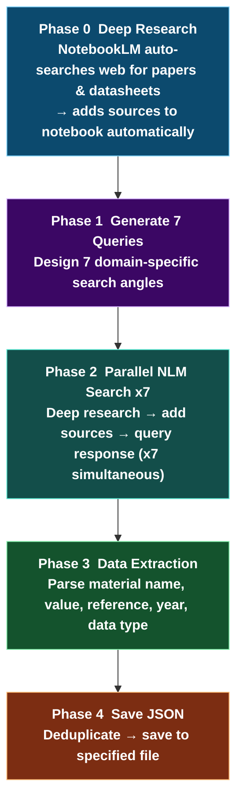

# matdb-builder

Automatically collect material property data from research papers, technical datasheets, and reports — organized into a searchable, filterable, CSV-exportable database.  
Powered by NotebookLM deep research + Claude Code. **No code editing. Just answer 7 questions in chat.**

> **Real-world result**: 95 entries of Young's Modulus data extracted from 31 papers for amine-cured epoxy resin in **~8 minutes**

---

## How It Works


### Pipeline Internals



---

## Prerequisites (One-time Setup)

| Item | Steps |
|------|-------|
| **Claude Code** | [https://claude.ai/code](https://claude.ai/code) — Claude Pro subscription required ($20/mo) |
| **Python 3.8+** | Run `python --version`. Install from [python.org](https://python.org) if missing |
| **NotebookLM MCP CLI** | In PowerShell: `pip install notebooklm-mcp-cli` |
| **NotebookLM Login** | In PowerShell: `nlm login` → sign in with your Google account |

---

## Installation

```powershell
git clone https://github.com/dudtjq414/matdb-builder.git
cd matdb-builder
claude
```

> **⚠️ You must run `claude` from inside the `matdb-builder` folder.**  
> Claude Code reads `.claude/settings.json` to load the NotebookLM MCP — this only works when started from this directory.  
> Typing `! cd matdb-builder` inside the Claude Code chat does **not** work.

---

## Usage

Type in the Claude Code chat:

```
run pipeline
```

Claude will ask 7 questions one by one:

| # | Parameter | Example |
|---|-----------|---------|
| 1 | NotebookLM notebook URL | `https://notebooklm.google.com/notebook/abc123-...` |
| 2 | Material / system | `amine-cured epoxy resin` |
| 3 | Property to measure | `Young's Modulus` |
| 4 | Unit | `GPa` |
| 5 | Data classification criterion | `epoxy type` |
| 6 | Measurement methods to exclude | `DMA storage modulus, nanoindentation` (type `none` if not needed) |
| 7 | Output filename | `epoxy-youngs-modulus.json` (type `none` for default) |

The pipeline starts automatically after all 7 answers (~5–10 min).

---

## Viewing Results

Open `results-viewer.html` in your browser, then drag and drop the generated JSON file to search, filter, sort, and export to CSV.

---

For full documentation → [PIPELINE_README.md](./PIPELINE_README.md)

---

<details>
<summary>한국어 가이드 (Korean Guide)</summary>

## 소개

논문·기술 데이터시트·보고서에서 재료 물성 수치 데이터를 자동으로 수집하여 검색·내보내기 가능한 데이터베이스로 만드는 도구입니다.  
NotebookLM의 딥리서치 기능과 Claude Code(AI)를 연동하며, **코드 수정 없이 채팅창 질문만으로** 전체 파이프라인이 실행됩니다.

> **실제 사례**: 아민계 에폭시 수지의 Young's Modulus 데이터 **95건**을 31편 논문에서 **약 8분** 만에 자동 추출

## 사전 준비 (최초 1회)

| 항목 | 방법 |
|------|------|
| **Claude Code 설치** | [https://claude.ai/code](https://claude.ai/code) — Claude Pro 구독 필요 (월 $20) |
| **Python 3.8+** | `python --version` 으로 확인. 없으면 [python.org](https://python.org) 설치 |
| **NotebookLM MCP CLI** | PowerShell: `pip install notebooklm-mcp-cli` |
| **NotebookLM 로그인** | PowerShell: `nlm login` → 브라우저에서 Google 계정 로그인 |

## 설치 및 시작

```powershell
git clone https://github.com/dudtjq414/matdb-builder.git
cd matdb-builder
claude
```

> **⚠️ 반드시 `cd matdb-builder` 후 `claude`를 실행**해야 합니다.  
> Claude Code가 matdb-builder 폴더에서 시작되어야 `.claude/settings.json`이 로드되어 NotebookLM MCP가 자동으로 연결됩니다.

## 사용법

Claude Code 채팅창에 입력:

```
파이프라인 실행해줘
```

Claude가 아래 7가지 정보를 하나씩 질문합니다:

| # | 질문 항목 | 입력 예시 |
|---|-----------|----------|
| 1 | NotebookLM 노트북 URL | `https://notebooklm.google.com/notebook/abc123-...` |
| 2 | 연구 재료/시스템 | `아민계 경화 에폭시 수지` |
| 3 | 측정 물성 | `Young's Modulus` |
| 4 | 물성 단위 | `GPa` |
| 5 | 데이터 분류 기준 | `에폭시 계열` |
| 6 | 제외할 측정 방법 | `DMA E', 나노인덴테이션` (없으면 `없음`) |
| 7 | 결과 파일명 | `epoxy-youngs-modulus.json` (없으면 `없음`) |

자세한 사용법은 [PIPELINE_README.md](./PIPELINE_README.md)를 참고하세요.

</details>
